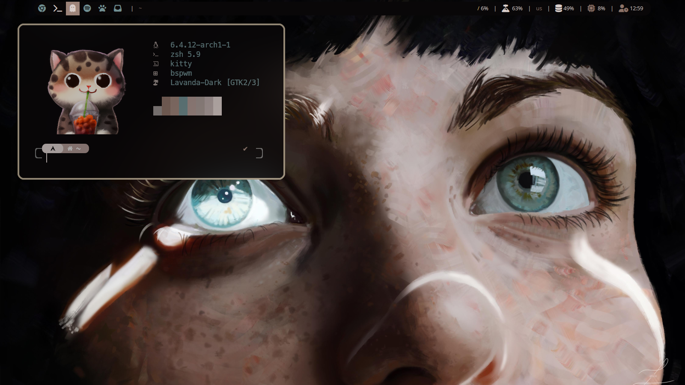
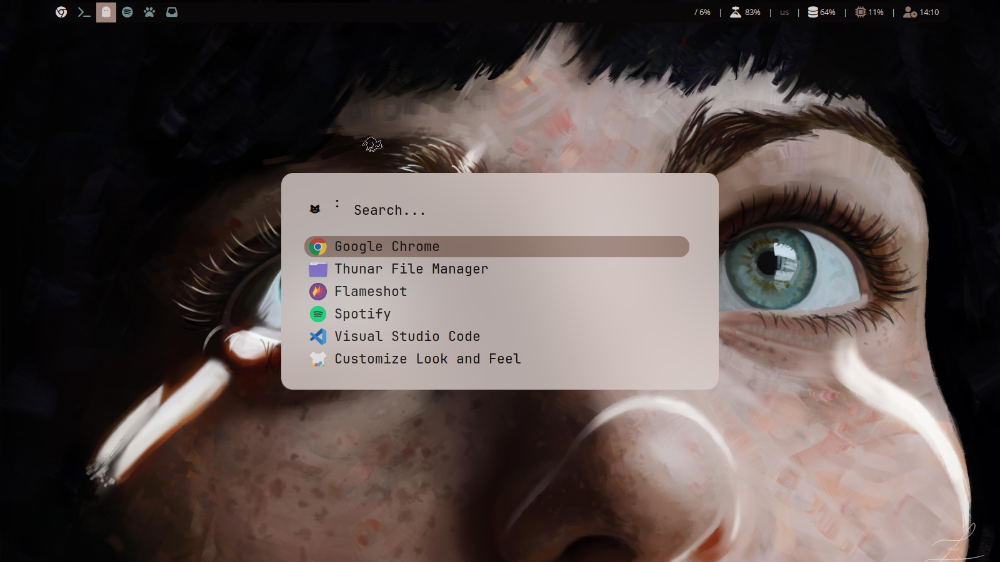
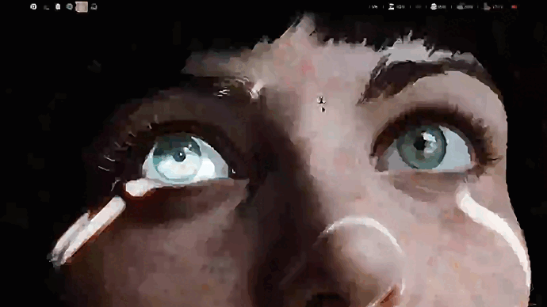

<h1> MEOW DOTS 🐱 </h1>

 My First Dots, will be adding more to this

<h2>ShowCase</h2>
</img>

<h2>Rofi,Noob ShowCase</h2>
</img>

<h2>Picom In Action</h2> 

- Window Manager: [Bspwm](https://github.com/baskerville/bspwm)
- Keys: [sxhkd](https://github.com/baskerville/sxhkd)
- Bar: [Polybar](https://github.com/polybar/polybar)
- Compositor: [Picom/ftlabs](https://github.com/FT-Labs/picom)
- Terminal: [Kitty](https://github.com/kovidgoyal/kitty)
- Shell: [zsh](https://github.com/romkatv/powerlevel10k)
- File Manager: [Thunar](https://github.com/xfce-mirror/thunar)
- Pywal: [ColorScheme Generator](https://github.com/dylanaraps/pywal)
- rofi: [Application Manager](https://github.com/davatorium/rofi)
- Fonts: Fonst Awesome/JetBrains mono

